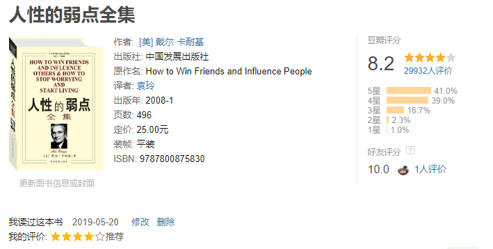
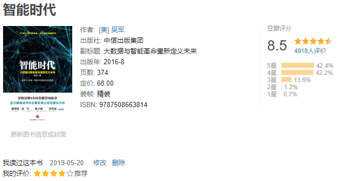
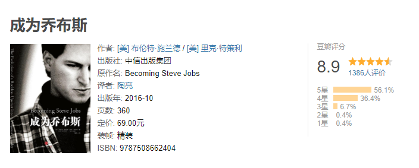
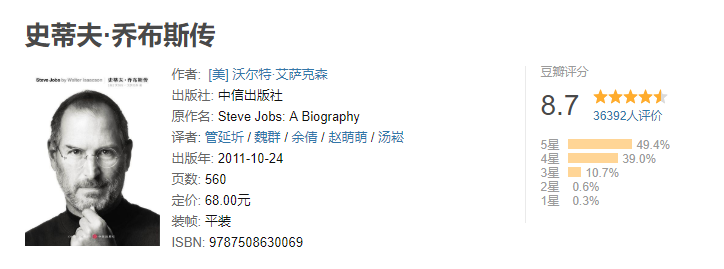
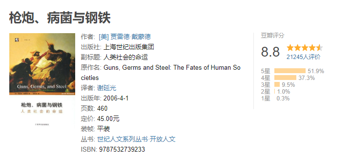
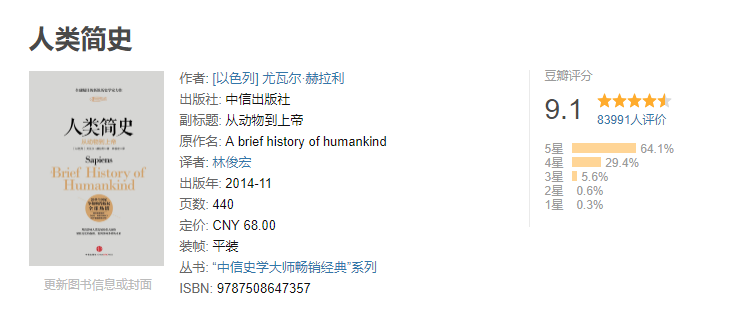
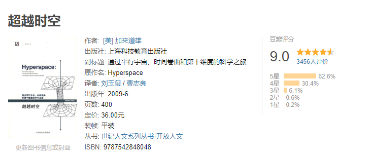
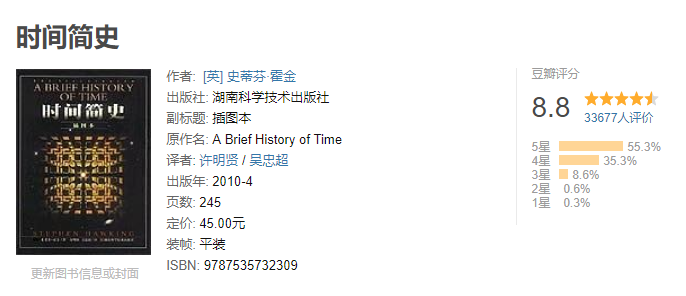
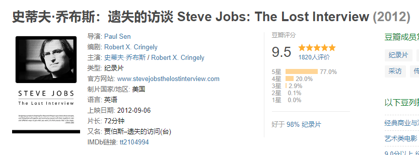

# Soft-Skills  技术之外
越来越发现，软技能和技术能力一样重要。如果说技术能力决定了你个人发展的下限，软技能则决定你能达到的上限。

这里软技能主要包括：

* 学习能力
* 沟通、表达能力
* 领导力
* 意志力
* 商业洞察力

本项目旨在帮助自己提高除技术之外各项能力。to be a better man

## 书单

### 1：人性的弱点

### 2：智能时代

### 3 ：浪潮之巅

### 4：文明之光

### 5：成为乔布斯

本书描绘了一位多姿多彩的人物将与生俱来的激情与成熟的管理方式相结合，打造出史上最有价值、最受消费者追捧的公司，这本书将彻底改变我们看待乔布斯的方式。

本书推翻了关于史蒂夫·乔布斯的传说和陈词滥调，比如他是天才和混蛋的结合体，暴躁易怒、自私自利，怠慢朋友与家人。本书揭示了这位苹果联合创始人和CEO的家庭生活与职业生涯，并回答了一个关键问题：为什么如此轻狂傲慢、以至于被赶出苹果的年轻人能成为史上最高效、最具有远见的商业领袖，从而改变几十亿人的生活？

布伦特·施兰德和里克·特策利通过可靠的信息来源，甚至是独家渠道，还原了真实的史蒂夫，描绘他如何将自身的优点发挥到极致并与缺点作斗争。生动有趣的故事来源于最了解乔布斯的人，包括他的家人以及苹果、皮克斯和迪斯尼的高管团队成员，特别是蒂姆·库克、乔尼·艾维、埃迪·库埃、埃德·卡特穆尔、约翰·雷斯特和鲍勃·伊戈尔，他们愿意向作者敞开心扉，聊一聊他们心目中的史蒂夫。另外，布伦特与乔布斯的交情长达25年，对他进行了多次公开或非公开采访，并将采访素材写进了书里。布伦特和里克将乔布斯还原为真实存在的人，对他的行为进行了详细阐释，而不仅仅是简单描述。本书还描绘了我们都曾经历过的技术变革以及乔布斯改变世界的过程。

布伦特和里克明确指出，乔布斯在苹果的成果不仅仅在于选择正确的产品，他变得更有耐心，对核心团队全权信任，让公司在循序渐进中稳步发展，而非寄希望于几件一鸣惊人的产品。

### 6：乔布斯传

这本乔布斯唯一授权的官方传记，在2011年上半年由美国出版商西蒙舒斯特对外发布出版消息以来，备受全球媒体和业界瞩目，这本书的全球出版日期最终确定为2011年11月21日，简体中文版也将同步上市。

两年多的时间，与乔布斯40多次的面对面倾谈，以及与乔布斯一百多个家庭成员、 朋友、竞争对手、同事的不受限的采访，造就了这本独家传记。

尽管乔布斯给予本书的采访和创作全面的配合，但他对内容从不干涉，也不要求出版前阅读全文的权利。对于任何资源和关联的人，他都不设限，甚至鼓励他所熟知的人袒露出自己的心声。

“我已经做了很多并不值得自豪的事情，比如23岁时就让我的女友怀了孕，以及我对这件事的处理方式”，他说， “对我而言，没有什么不可以对外袒露的。”

谈及和他共过事的人以及竞争对手，他直言不讳，甚至尖酸刻薄。他的激情、精力、欲望、完美主义、艺术修养、残暴还有对掌控权的迷恋塑造出的商业哲学一览无余。

同样，他的朋友、敌人，还有同事得以为我们提供了一个前所未有的毫无掩饰的视角。

他是一位极具创造力的企业家，他有如过山车般精彩的人生和犀利激越的性格，充满追求完美和誓不罢休的激情，他创造出个人电脑、动画电影、音乐、手机、平板电脑以及数字出版等6大产业的颠覆性变革。

乔布斯的个性经常让周围的人愤怒和绝望，但其所创造出的产品也与这种个性息息相关，全然不可分割的，正如苹果的硬件和软件一样。

他的故事既具有启发意义，又有警示意义，充满了关于创新、个性、领导力以及价值观的教益。

### 7：枪炮、病菌与钢铁

什么是欧亚大陆人征服、赶走或大批杀死印第安人、澳大利亚人和非洲人，而不是相反？为什么么小麦和玉米、牛和猪以及现代世界的其他一些“不了起的”作物和牲畜出现在这些特定地区，而不是其他地区？在这部开创性的著作中，演化生物学家贾雷德.戴蒙德揭示了事实上有助于形成历史最广泛模式的环境因素，从而以震撼人心的力量摧毁了以种族主义为基础的人类史理论，因其突出价值和重要性，本书荣获1998年美国普利策奖和英国科普书奖，并为《纽约时报》畅销书排行榜作品。

本书是理解人类社会发展史方面的一个重大进展，它记录了现代世界及其诸多不平等所以形成的原因，也是一部真正关于全世界各民族的历史，是对人类生活的完整一贯的叙述，娓娓道来，具有很强的可读性。

### 8 人类简史

《人类简史：从动物到上帝》是以色列新锐历史学家的一部重磅作品。从十万年前有生命迹象开始到21世纪资本、科技交织的人类发展史。十万年前，地球上至少有六个人种，为何今天却只剩下了我们自己？我们曾经只是非洲角落一个毫不起眼的族群，对地球上生态的影响力和萤火虫、猩猩或者水母相差无几。为何我们能登上生物链的顶端，最终成为地球的主宰？

从认知革命、农业革命到科学革命，我们真的了解自己吗？我们过得更加快乐吗？我们知道金钱和宗教从何而来，为何产生吗？人类创建的帝国为何一个个衰亡又兴起？为什么地球上几乎每一个社会都有男尊女卑的观念？为何一神教成为最为广泛接受的宗教？科学和资本主义如何成为现代社会最重要的信条？理清影响人类发展的重大脉络，挖掘人类文化、宗教、法律、国家、信贷等产生的根源。这是一部宏大的人类简史，更见微知著、以小写大，让人类重新审视自己。

### 9 超越时空

当代物理学中一些非常重要而又艰深的思想，往往因为难以形象浅显地解说而不易为公众了解。本书作者不畏艰辛，用很生动的方式向读者展示了现代物理前沿之一——超空间理论。全书15章分为4篇，分别描述了超空间的研究历史，超空间理论通往爱因斯坦梦寐以求的“物理学圣杯”统一场论的可能性，通过超空间穿越时空的可能性的理论探讨，以及何时方能实际利用超空间理论所具有的潜在威力。详尽而又如此通俗地讲述这种理论，在本书之前尚未见先例。

### 10 时间简史

《时间简史》讲述是探索时间和空间核心秘密的故事，是关于宇宙本性的最前沿知识，包括我们的宇宙图像、空间和时间、膨胀的宇宙不确定性原理、基本粒子和自然的力、黑洞、黑洞不是这么黑、时间箭头等内容。第一版中的许多理论预言，后来在对微观或宏观宇宙世界观测中得到证实。

自1988年首版以来，《时间简史》已成为全球科学著作的里程碑。它被翻译成40种文字，销售了近1000万册。此版更新了内容，把许多观测揭示的新知识，以及霍金最新的研究纳入，并配以250幅照片和电脑制作的三维和四维空间图。

## 影音

### 1 史蒂夫·乔布斯：遗失的访谈

A conversation with Steve Jobs as he was running NeXT, the company he had founded after leaving Apple.

