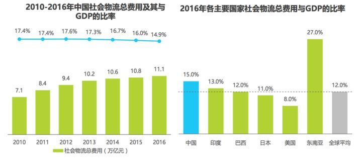
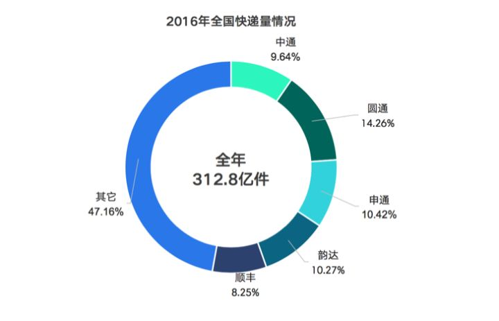
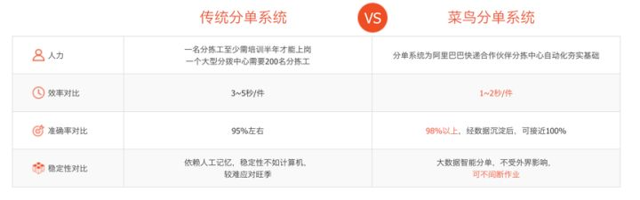
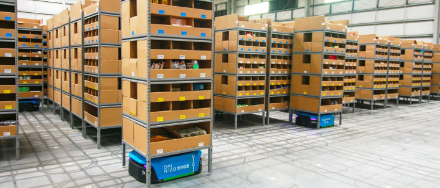

# 你们有谁知道，菜鸟网络到底是做什么的？

在开始之前，大家先问一个问题：提起淘宝上购物的物流服务，大家首先想到的是什么？

进入脑海的，肯定是如下字眼：双十一爆仓、物流慢、服务差、包装破损、不能送货上门等等。

其实这也反映了当前中国物流行业的现状。

## 中国物流行业的现状

**物流效率低，物流成本高**

中国的电商业务的繁荣是的确是欧美国家所不能比拟的，不过中国社会物流成本占GDP比例之高，同样也是欧美所不能比拟的。

中国物流成本占总GPD约15%左右，而欧美只占8%左右。占比约高，说明物流行业效率越低。而中国物流费用的市场总量为10万亿级别的（2016年物流行业总费用为11.1万亿），每下降1%，对应的收益都是千亿级别。

图片来源：艾瑞咨询-2017年中国物流科技行业研究报告

**快递大而不强**

虽然快递产业规模越来越大，集中度也很高，但其实还是比较传统和低效，尤其是占据快递行业80%份额以上的通达系，基本上仓储、分拣等，都是以人力为主，自动化程度非常低，更不用说采用人工智能和大数据等先进技术了。

由于快递的需求绝大部分来自于电商（主要是阿里系），产品服务的单一性造成行业从业者很难获取超额利润，只能通过“降低成本—>通过价格战获得市场份额—>规模效应进一步降低成本”的循环，快递公司无意也无力通过优化效率和提高自动化程度来降低成本，一门心思通过持续扩大规模来进一步降低成本，这是最直接的，也是其最拿手的。

发达国家的仓储自动化平均普及率达到80%，而我国目前仅为20%。

**成本和服务难两全**

有人会说，通达系服务又槽糕，又慢，而顺丰又快，服务又好，为什么不全部用顺丰？

是啊，为什么不用？

首先，顺丰只占了物流体系很小的体量，根据2016年的统计数据可以看到，顺丰占的量连1/10都不到。

既然顺丰这么好——服务又好，又快，大家为什么不都用顺丰呢？

一个字——贵啊。

贵的原因之一是顺丰以航空件为主，顺丰基本上垄断了国内的航空件。航空件比走陆路的成本贵很多，大家都可以理解。

还有一个原因是顺丰的快递员的成本。与通达系的一线网点都是加盟模式不同，顺丰的快递人员网络都是直营的（这一点和京东很像）。可以理解为四通一达的快递员都是临时工（外包），而顺丰的快递员都是正式工（合同工）。一方面正式工的成本本身就比外包要贵（要给员工交五险一金），还有快递员送每个件的提成是不一样的。通达系的一个件一般提成1块钱，而顺丰和京东的一个件提成一块五到两块钱左右。

这么算下来，就知道为什么顺丰和京东的配送成本贵这么多了。

对于高价值的商品，贵这么一点配送费没什么问题，对于低价值的小商品，配送费高好几块真的会要商家的命。

就像买东西一样，贵的不一定有贵的道理，但是便宜一定有便宜的道理。

如果要通达系按照顺丰、京东的服务标准去做，快递员一天送不了几单，自然挣不着钱，那真的要喝西北风去了。

## 菜鸟成立背后的真正原因

就是在这样的背景下，菜鸟网络成立了。

菜鸟成立的时候，众说纷纭，有人说马云要做物流了，要抢快递行业的饭碗了。

其实并不是这个样子，菜鸟目前有几千号员工，并没有一个员工是快递员，也没有一辆物流运输车。

那么菜鸟到底为什么要成立呢？

从阿里巴巴本身的角度来说，阿里是靠电商起家的，电商也是阿里的根基。

随着淘宝/天猫的发展，以及蚂蚁金服（支付宝）的发展，电商平台和支付的问题都已经解决了，但是一直漏了很重要的一环——物流。

这个环节在刚开始的时候还不是那么重要，但是随着消费升级，大家对时效性和物流体验越来越看重，物流体验成了淘宝/天猫最大的瓶颈。尤其是随着亚马逊和京东的机制物流体验的衬托下，这个软肋更加明显。

所以，弥补这个物流的短板就成了阿里的当务之急。

上面是从阿里自己的角度来分析。

下面从行业角度来分析。

当前中国的快递业务的80%左右是淘宝/天猫的电商购物，而这些量基本上都是由通达系来覆盖的。可以说，当时淘宝的成长给通达系带来了机会，通达系也不负众望的迎来了快速发展。

受限于自身水平，通达系给淘宝/天猫的购物体验拉了后腿。

作为国内顶尖的科技公司，阿里自认为有种这个技术实力和担当，为整个行业搭建物流行业AI、云计算、大数据分析等基础设施，去拉通达系一把，也拉整个行业一把，让整个行业的服务体验和时效性得到大幅提升，也就说所谓的对整个物流行业“赋能”。

简单概括一下，阿里成立菜鸟，既为了补自己的物流短板，也是为了给整个物流行业“赋能”，提升整个物流行业的服务水平。

自成立起，菜鸟的使命就是：全国24小时，全球72小时必达。

当然，菜鸟这方面也确实做的不错，从号称物流行业“春运”的双十一来看，大家直观上感觉每年“爆仓”的现象越来越少，2017年更是基本上杜绝了这种现象。客观上也是如此，一亿包裹签收时间从2013年的9天，2014年的6天，2015年的4天，2016年的3.5天，到2017年的2.8天。

这一步步就是菜鸟和整个物流同行们共同努力的成绩。

## 菜鸟都做了什么

我们经常说：**评价一个人不要看他说了什么，而要看他做了什么，评价一个公司也是这样。**

就像有些互联网公司，明面上说的好听，实际上做的是竞价排名，吃不良医院的回扣，人血馒头吃的很香。

菜鸟内部一直在强调“回归初心”，在衡量一件事情要不要做的时候，菜鸟会思考，这件事情该不该做？菜鸟不做，别人能不能做，能不能做好？如果别人不能做或者做不好，那就菜鸟来做。

所以菜鸟这些年一直做一些行业里“脏苦累”的活，也不赚钱。

先不说虚的，说下菜鸟做的事情吧。

**第一件事是开发电子面单**。

电子面单其实是统一了快递面单的单号的格式，让行业里有了统一的标准格式，便于管理和追踪，就类似于当年秦始皇书同文、车同轨，统一度量衡一样。

先说一下电子面单出现时的背景。

大家知道，用户下单后，商家需要发货，这时电商平台的商家需要把物流信息对接到自己的内部ERP系统中。

这种情况下，商家需要和快递公司一一对接，如果你的商品分发给3家物流公司，那么你需要和三家快递公司一一对接，因为每一家物流公司的单号都不一样，给商家造成了极大的人力物力的浪费。

有了电子面单之后，由于格式统一了，只需要对接一次就可以，省时省力。

对于快递公司而言，电子面单更便宜（节省成本）、打印更方便（节省时间）和方便黏贴不易脱落（使用方便），快递公司也是大喜过望。

于是乎，电子面单很快就推广开了。

**第二件事是智能仓储和智能配送**。

物流行业里面经常讲仓配。其实确切来讲，仓是仓，是仓储；配是配，是配送。

商家接单之后，先是仓储环节：分单，拣货，二次分拣，包装，出库。

然后是配送：包裹到达分拨点进行分拨，经过物流车运输到下一个分拨点这样逐层分拨，最后到网点，由快递员送到最终用户手里。

这个过程，听起来简单，好像没什么技术含量，但是其中的技术含量在于效率。

效率的高低（专业名词叫做“人效“）直接决定了这家企业的运营成本，也决定了企业的利润和竞争力。

而直接影响人效高低的，不是看得见的工作人员，而是支持企业运营的后台系统。当前物流公司的后台系统多是由一些第三方小公司开发的，虽然能够支持业务流，但是效率不高，体验不佳。

为了解决这个问题，菜鸟花了很大力气，开发了一套后台系统，如智能仓储系统和智能配送系统，给这些合作伙伴提供后台支持，从而大幅提升其效率，降低其成本。

就拿仓储环节的分单系统举例子，下图为传统分单系统和菜鸟分单系统的对比。

就拿仓储环节的分单系统，下图为传统分单系统和菜鸟分单系统的对比。

正是这一点点效率的提升，让整个行业变得越来越好。

**第三件事是搭建仓储和末端网络**。

物流行业是非常讲究规模效应的，为了让整个链路更有效率，解决行业的痛点，需要给行业建立基础设施。

首先，需要先解决仓储的问题。

为了能够提高物流配送的时效性，和京东和亚马逊一样，菜鸟也一些关键节点建仓或者整合一些闲置仓储资源，作为前置仓，租给商家和合作伙伴用。

而且可以根据之前销量的大数据进行分析，将商品提前配送备货到距离最近的仓库，这样用户下单后配送时间就可以大大缩短，从而可以实现当日达或次日达，甚至可以实现2小时送达。甚至，在新零售模式下，用户下单后，商家可以从距离消费者最近的门店发货，可以做到比仓库更近。

其次，在最后一公里的配送上，快递员由于工作负荷大，收入低（每件提成少），风险高（经常面临罚款），全年无休的问题，面临严重的招工难，已经存在较大的人才缺口。

而未来随着行业的进一步发展，未来包裹数量会进一步增多，按照当前趋势发展，预计2020年的快递员人才缺口将为200万左右。

为了解决这个问题，需要进一步优化最后一公里的配送流程。

为此菜鸟搭建了最后一公里菜鸟驿站+自提柜的网络，既能够方便用户在自己方便的时候取件，也能够大幅减小了快递员的工作强度和单件派送时间。

不过，放驿站或者自提柜是必须要征求用户同意才可以的，如果用户不同意，快递员是必须送货上门的（和之前一样）。

不过目前用户反馈比较多的是，很多快递员不经用户同意直接放在驿站或者自提柜里，这是不被允许的，遇到这种情况可直接投诉快递员，注意，一定要投诉快递员，投诉驿站没用的。

此外，菜鸟还利用大数据和人工智能来做动态路由和车辆路径规划，智能备货提醒，智能箱型推荐等等，还利用最新的技术，比如仓内AGV机器人和无人配送物流车来帮助合作伙伴提升效率，降低成本。

仓 

## 纵有千般委屈，更与何人说

值得一提的是，很多业务，只要菜鸟参与其中，一旦业务出了问题，挨骂的总是菜鸟，比如快递员没有送货上门，包裹出现破损等等，大家都会抱怨菜鸟做的不好。

很多内部同事也很委屈，明明不是我们的错，为什么要我们来背负这个责任。

前段时间的内部会议上，有位领导说的很好：当初菜鸟选择做这样的事情，就已经做好了被曲解被误会的心理准备。禁得起多大诋毁，就能受得起多大赞美。

你知道自己在做伟大的事情，即使现在不被人理解，只要你坚持做下去，总有一天，世人会明白你。不被嘲笑的梦想，不值得去实现。

的确，菜鸟在做的事情，国内没有先例，国际上也没有先例。

菜鸟，将会在这条孤独的道路上，越走越远。